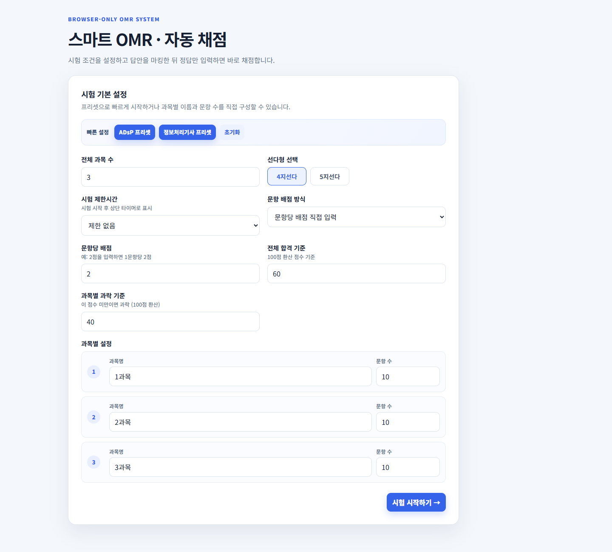

# CBT OMR Tester



> 자격증 및 모의고사 대비를 위한 사용자 맞춤형 단일 HTML 기반 웹 OMR & 자동 채점 도구임

## 프로젝트 개요

- 별도의 백엔드 서버나 설치 없이 브라우저에서 즉시 실행 가능한 CBT(Computer Based Test) 연습용 OMR 시트임
- ADsP, 정보처리기사, 공무원 시험 등 다양한 객관식 시험에 맞춰 과목 및 배점 구조를 자유롭게 커스텀 가능함

## 주요 기능

- **시험 환경 맞춤 설정**: 과목 수, 과목명, 과목별 문항 수 자유 구성 지원
- **선택지 및 배점 옵션**: 4지선다 / 5지선다 선택 및 문항별 개별 배점 또는 100점 만점 자동 배점 지원
- **실시간 OMR 및 진행률**: 과목별 답안 마킹, 안 푼 문제 수 및 응답 진행률 실시간 표시
- **합격 / 과락 판정**: 전체 합격 기준 점수 및 과목별 과락 기준(예: 과목당 40점 미만) 동시 검증
- **자동 채점 및 오답 분석**: 정답 일괄 입력 후 총점, 100점 환산 점수, 제출 답안 vs 정답 비교표 제공
- **반응형 UI**: PC 및 모바일 환경 지원

## 사용 방법

1. `CBT.html` 파일을 웹 브라우저(Chrome, Edge 등)로 직접 열어 실행함
2. 초기 설정 화면에서 시험 조건(과목 수, 문항 수, 배점, 과락 기준 등)을 입력하고 시험 시작을 클릭함
3. OMR 시트에 답안을 작성한 후 정답을 입력하여 채점 결과 및 오답 노트를 확인함

##  미리보기 갱신 (개발자용)

```bash
npm install
npm run capture
```

Playwright 및 헤드리스 브라우저를 사용하여 프로젝트 루트의 `screenshot.png`를 자동 갱신함

---

**_향후 모바일 앱으로 배포 및 기능 고도화 예정_**